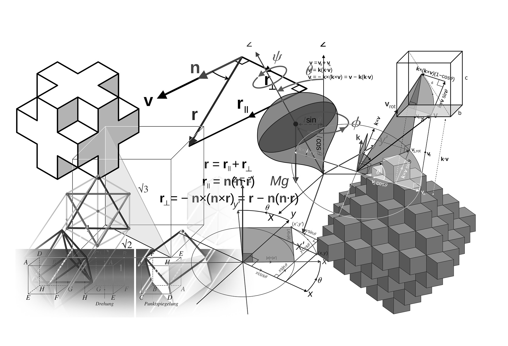

<!-- PROJECT SHIELDS -->
[![Contributors][contributors-shield]][contributors-url]
[![Forks][forks-shield]][forks-url]
[![Stargazers][stars-shield]][stars-url]
[![Downloads][downloads-shield]][downloads-url]
[![CC BY 4.0][license-shield]][license-url]

<!-- PROJECT LOGO -->
 

    
  </a>

  <h3 align="center">A-Level Further Mathematics Summary Notes</h3>

  

    <a href="https://github.com/NousernameSG/FurtherQ-Problem-Sets/issues">Report Bug</a>
    ·
    <a href="https://github.com/NousernameSG/FurtherQ-Problem-Sets/issues">Request Feature</a>
    ·
    <a href="https://www.buymeacoffee.com/nousernamesg">Support My Work</a>
  

<!-- TABLE OF CONTENTS -->

  
Table of Contents

  <ol>
    <li>
      <a href="#about-the-project">About The Project</a>
      <ul>
        <li><a href="#built-with">Built With</a></li>
      </ul>
    </li>
    <li><a href="#Latest Downloads">Latest Upload</li>
    <li><a href="#license">License</a></li>
    <li><a href="#contact">Contact</a></li>
    <li><a href="#acknowledgments">Acknowledgments</a></li>
  </ol>

<!-- ABOUT THE PROJECT -->
## About The Project

This is a collection of my personal notes that I'm using during my study for the Singapore-Cambridge GCE 'A' Levels Further Mathematics Subject

(<a href="#readme-top">back to top</a>)

### Built With

* [![LaTeX][LaTeX-Shield]][LaTeX-url]

(<a href="#readme-top">back to top</a>)

<!-- LATEST Upload -->
## Latest Upload

  
Summary Notes

    Version Date: 19 March 2023  
    File Size: 252 KB  

<!-- LICENSE -->
## License

This work is licensed under a [Creative Commons Attribution 4.0 International License][license-webpage].

[![CC BY 4.0][license-mark]][license-webpage]

See `LICENSE` for more information.

(<a href="#readme-top">back to top</a>)

<!-- CONTACT -->
## Contact

Email: nousernamesg@gmail.com  
Project Link: [https://github.com/NousernameSG/FurtherQ-Problem-Sets](https://github.com/NousernameSG/FurtherQ-Problem-Sets/)

(<a href="#readme-top">back to top</a>)

<!-- ACKNOWLEDGMENTS -->
## Acknowledgments

* [Choose an Open Source License](https://choosealicense.com)
* [Image Shields List](https://github.com/Ileriayo/markdown-badges)
* [Image Shields](https://shields.io)

(<a href="#readme-top">back to top</a>)

<!-- MARKDOWN LINKS & IMAGES -->
<!-- https://www.markdownguide.org/basic-syntax/#reference-style-links -->
<!-- https://shields.io -->
[contributors-shield]: https://img.shields.io/github/contributors/NousernameSG/FurtherQ-Problem-Sets
[contributors-url]: https://github.com/NousernameSG/FurtherQ-Problem-Sets/graphs/contributors
[forks-shield]: https://img.shields.io/github/forks/NousernameSG/FurtherQ-Problem-Sets?label=Fork
[forks-url]: https://github.com/NousernameSG/FurtherQ-Problem-Sets/network/members
[stars-shield]: https://img.shields.io/github/stars/NousernameSG?affiliations=OWNER%2CCOLLABORATOR
[stars-url]: https://github.com/NousernameSG/FurtherQ-Problem-Sets/stargazers
[downloads-shield]: https://img.shields.io/github/downloads/NousernameSG/FurtherQ-Problem-Sets/total
[downloads-url]: https://github.com/NousernameSG/FurtherQ-Problem-Sets/releases
[license-shield]: https://img.shields.io/badge/License-CC%20BY%204.0-lightgrey.svg
[license-url]: https://github.com/NousernameSG/FurtherQ-Problem-Sets/blob/master/LICENSE
[license-webpage]: http://creativecommons.org/licenses/by/4.0/
[license-mark]: https://i.creativecommons.org/l/by/4.0/88x31.png
[LaTeX-Shield]: https://img.shields.io/badge/latex-%23008080.svg?style=for-the-badge&logo=latex&logoColor=white
[LaTeX-url]: https://www.latex-project.org/
[PS1-Download_Link]: https://github.com/NousernameSG/FurtherQ-Problem-Sets/files/10162908/FurtherQ.-.Problem.Set.1.4-10-22.zip/